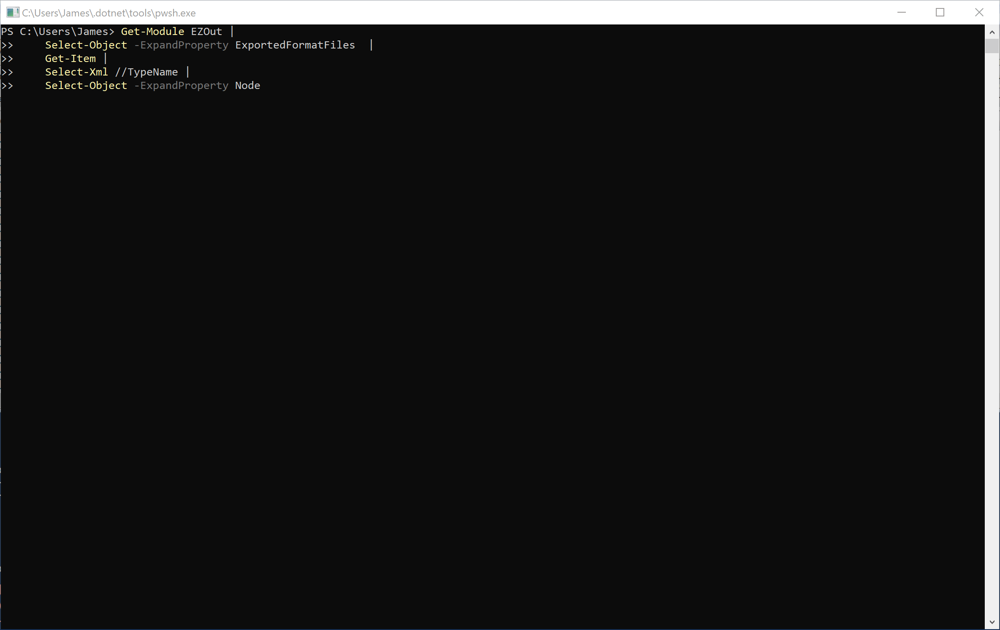
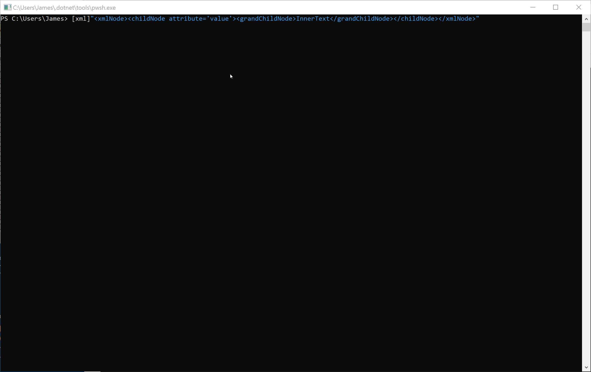

### Installing EZOut

You can install EZOut from the PowerShell Gallery.  Simply:
~~~PowerShell
Install-Module EZOut -AllowClobber -Scope CurrentUser
~~~

### Understanding PowerShell Formatting

Unlike many languages, PowerShell has a formatting engine built into the box.  
You can define one or more "Views" that will change how PowerShell will display an object.
These views are stored in a .format.ps1xml file, and loaded in a module manifest with the setting 'FormatsToProcess:'
This is an example of a minimal module with just a format file:

~~~PowerShell
@{
    ModuleVersion = 0.1
    FormatsToProcess = 'My.Format.ps1xml'
}
~~~

PowerShell formatting primarily supports three different types of views for any typename:
* A Table View
* A List View 
* A Custom View

Table and List Views are fairly straightforward:  You select some properties to display, and you get a table.

Custom Views, as the name implies, are anything you'd like them to be.  Custom views can also be defined as a control, which can be referenced in other custom views.

You most likely see complex custom controls everyday:  The most complex formatter built into PowerShell is the formatter for Help.

Objects in PowerShell are formatted according to their .pstypenames property.  If you're creating a normal .NET object, this property will be the inheritance hierarchy of the class.  For instance:

~~~PowerShell
# This will have three typenames:
# System.Management.Automation.CmdletInfo, System.Management.Automation.CommandInfo, and System.Object
# When you see the output of Get-Command, you're seeing the formatter for System.Management.CommandInfo
Get-Command Get-Command | Select-Object -ExpandProperty PSTypenames
~~~
You can switch out the typenames of any given object by manipulating the typenames property

~~~PowerShell
$helpCommand = Get-Command Get-Help  # Get the command Get-Help
$helpCommand.pstypenames.clear()     # Clear it's typenames
$helpCommand                         # When we echo it now, it will be unformatted.

$helpCommand.pstypenames.add('System.Management.Automation.CommandInfo') # This adds the formatting back
~~~

You can also define a single typename when creating an object from a hashtable.
As the typename in this example implies, you can have a valid typename in PowerShell that could never exist as a real type in .NET.

~~~PowerShell
[PSCustomObject]@{PSTypeName='http://My/TypeName/IsNot/A/Valid/.NET#Typename';N=1}
~~~

### Using EZOut

#### Using EZOut to build your formatting:

Switch to your module directory, then run:

~~~PowerShell
Write-EZFormatFile | Set-Content .\MyModule.EzFormat.ps1 -Encoding UTF8 # Replace MyModule with the name of your module
~~~

This file will contain the scaffolding to write your formatters.  Whenever you run this file, MyModule.format.ps1xml and MyModule.types.ps1xml will be regenerated.

For a working example of this, check out EZOut's own [.ezformat.ps1](/EZOut.ezformat.ps1) file.

We can declare formatters directly in the .ezformat.ps1 file, or within a /Formatting or /Views directory, in a file named .(format|view).(ps1|xml)

In the examples below, we will be piping to Out-FormatData (to combine all of the formatting) and Add-FormatData (to register it in a temporary module). 

##### Writing Table Views

Table views are the most commonly used view in PowerShell, and the default of Write-FormatView

~~~PowerShell
Write-FormatView -TypeName APerson -Property FirstName, LastName, Age |
    Out-FormatData |
    Add-FormatData
        
[PSCustomObject]@{PSTypeName='APerson';FirstName='James';LastName='Brundage';Age=38}
~~~
    
We can specify a -Width for each column.  Using a negative number will make the column right-aligned:

~~~PowerShell
Write-FormatView -TypeName APerson -Property FirstName, LastName, Age -Width -20, 30, 5 |
    Out-FormatData |
    Add-FormatData
        
[PSCustomObject]@{PSTypeName='APerson';FirstName='James';LastName='Brundage';Age=38}
~~~

We can also specify alignment using -AlignProperty, or use -FormatProperty to determine how a property is displayed, and even -HideHeader.

~~~PowerShell
Write-FormatView -TypeName MenuItem -Property Name, Price -AlignProperty @{Name='Center';Price='Center'} -FormatProperty @{
    Price = '{0:c}'
} -Width 40, 40 -HideHeader |
    Out-FormatData |
    Add-FormatData

[PSCustomObject]@{PSTypeName='MenuItem';Name='Coffee';Price=2.99}    
~~~

We can define a -VirtualProperty, which will display as a column but does not really exist.
Also, in most hosts, we can conditionally -ColorProperty or -ColorRow:
~~~PowerShell
Write-FormatView -Property Number, IsEven, IsOdd -AutoSize -ColorRow {
    if ($_.N % 2) { "#ff0000"} else {"#0f0"}
} -VirtualProperty @{
    IsEven = { -not ($_.N % 2)}
    IsOdd = { ($_.N % 2) -as [bool] }
} -AliasProperty @{
    Number = 'N'
} -TypeName N |
    Out-FormatData|
    Add-FormatData
        
1..5 | Foreach-Object { [PSCustomObject]@{PSTypeName='N';N=$_} }           
~~~
#### Using EZOut Interactively

As shown in the examples above, we can use EZOut to add formatting interactively, by piping to Add-FormatData.

~~~PowerShell
Import-Module EZOut

Write-FormatView -TypeName 'System.Management.ManagementObject#root\cimv2\Win32_VideoController' -Property Name, Memory, Mode -Width 30,15,40 -VirtualProperty @{ 
        "Memory" = {
            "$($_.AdapterRAM / 1mb) mb"
        }
    } -RenamedProperty @{
        "Mode" = "VideoModeDescription"
    } | 
        Out-FormatData |
        Add-FormatData
    
Get-WmiObject Win32_VideoController # Note, this example will only work on Windows, and not in PowerShell core
~~~

#### Using out-of-the-box formatting

EZOut ships with a few useful formatters that help improve your PowerShell experience, show you what you can do, and learn EZOut.

##### File Tree Formatter

Ever wanted to see a nice file tree in PowerShell?  With EZOut, it's a snap.  Just pipe a given directory or files into Format-Custom

~~~PowerShell
Get-Module EZOut | Split-Path | Get-ChildItem  | Format-Custom
~~~

##### Colorized XML Formatter

Wish you could see more of any XML node you're working with?  EZOut ships with a colorized XML formatter! (colors are supported in PowerShell.exe and pwsh.exe, but not in the PowerShell ISE)
~~~PowerShell
Get-Module EZOut |
    Select-Object -ExpandProperty ExportedFormatFiles  |
    Get-Item |
    Select-Xml //TypeName |
    Select-Object -ExpandProperty Node
~~~

This formatting works with all XML objects and elements, and makes compact XML easier to read.
~~~PowerShell
[xml]"<xmlNode><childNode attribute='value'><grandChildNode>InnerText</grandChildNode></childNode></xmlNode>"
~~~

##### Rich Module Formatting

Want to see a bit more about a module?
EZOut ships with a rich PSModuleInfo formatter, which will display the module name, version, about topic, and a Markdown table of module commands:
~~~PowerShell
Get-Module EZOut | Format-Custom
~~~

